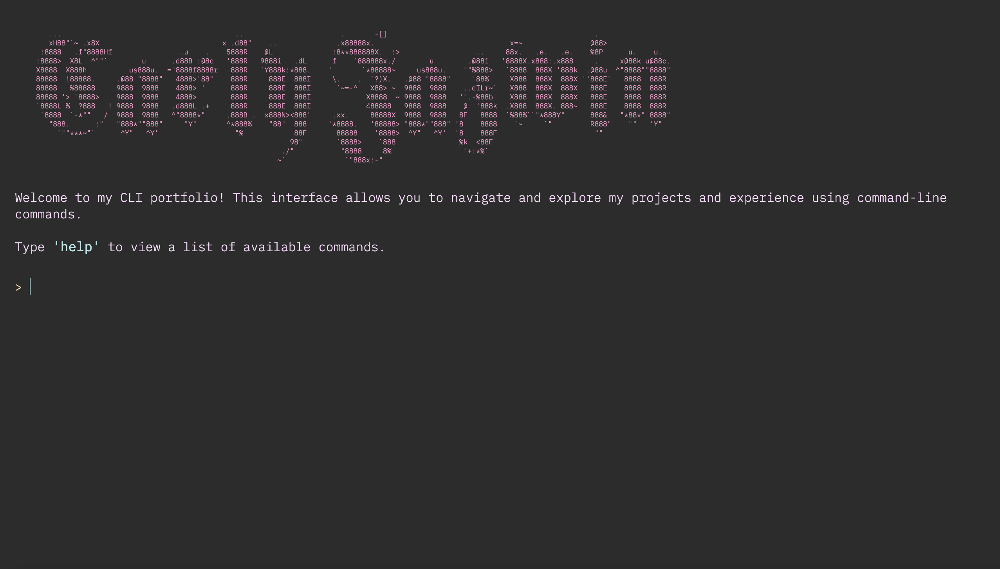
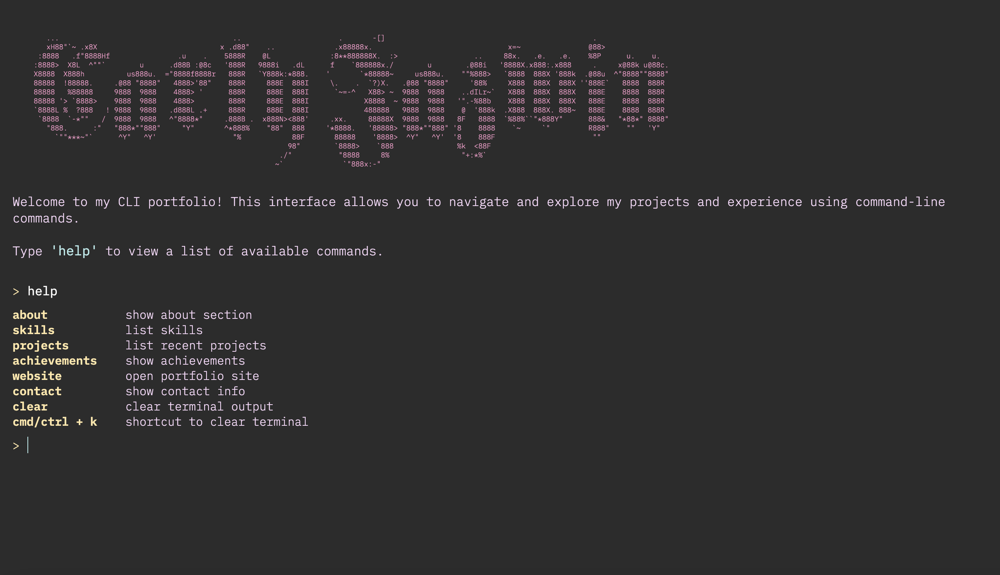
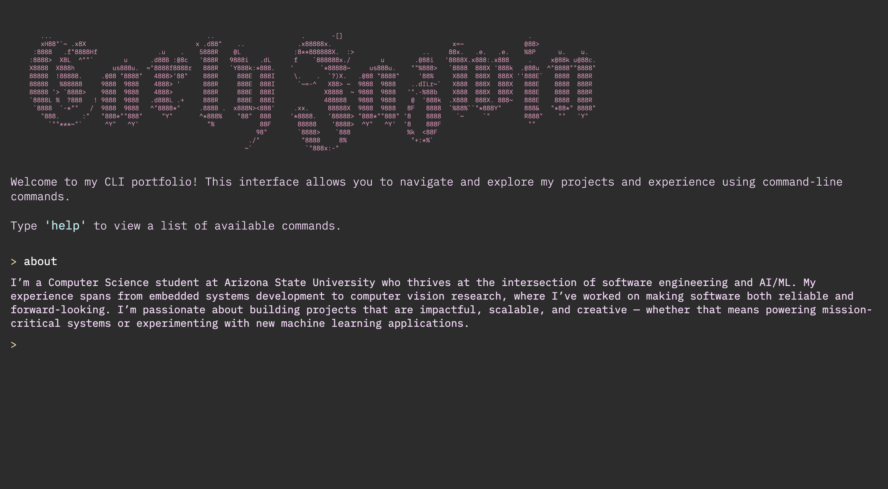
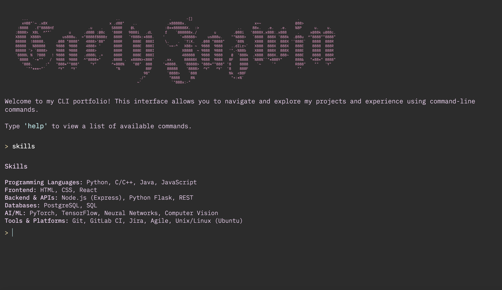
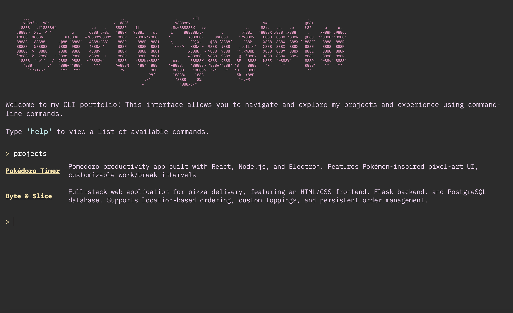

# Terminal-Style Portfolio Website

## Table of Contents
- [Overview](#overview)
- [Built With](#built-with)
- [Screenshot](#screenshot)

## Overview
- Unlike a typical GUI-based portfolio, this site is presented as a command-line interface.  
- Type the `help` command to see all available options.  
- Each command reveals different information about me—who I am, my skills, projects, contact details, and more.  
- Use the `website` command to open my traditional GUI portfolio site.  
- The project is built entirely with HTML, CSS, and vanilla JavaScript.  

## Screenshot

## Built With
- HTML  
- CSS  
- JavaScript  
